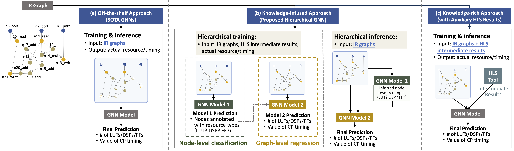

# High-Level Synthesis Performance Prediction using GNNs: Benchmarking, Modeling, and Advancing

<!-- TABLE OF CONTENTS -->
## Table of Contents

* [About the Project](#about-the-project)
* [Benchmarking](#benchmarking)
* [Modeling and Advancing](#modeling-and-advancing)
* [Toy Examples and Visualization](#toy-examples-and-visualization) 
* [Prerequisites](#prerequisites)
* [Road Map](#road-map)

<!-- ABOUT THE PROJECT -->
## About The Project

This project aims to explore the capability of GNN-based predictors in HLS design performance evalution, where the ultimate goal is to provide fast and accurate circuit quality evaluation from early design stages as well as to facilitate hardware agile design.

<figure>
  
</figure>

#### Contribution
* Benchmarking: we build a standard benchmark containing 40k C synthesizable programs, which includes both synthetic programs and three sets of real-world HLS benchmarks. Each program is implemented on FPGA to generate ground-truth performance metrics. 
* Modeling: we formally formulate the HLS performance prediction problem on graphs, and propose multiple modeling strategies with GNNs that leverage different trade-offs between prediction timeliness (early/late prediction) and accuracy. 
* Advancing: we further propose a novel hierarchical GNN that does not sacrifice timeliness but largely improves prediction accuracy, significantly outperforming HLS tools 

#### The papers related to this project
* DAC 2022: [High-Level Synthesis Performance Prediction using GNNs: Benchmarking, Modeling, and Advancing](https://arxiv.org/abs/2201.06848)
* More statistics of the benchmark: [Program-to-Circuit: Exploiting GNNs for Program Representation and Circuit Translation](https://arxiv.org/abs/2109.06265)

<!-- Benchmarking -->
## Benchmarking
#### Synthetic data
* Synthetic C programs are generated by [ldrgrn](https://github.com/gergo-/ldrgen).
* [Our scripts of program generation, HLS execution, and FPGA implementation](https://github.com/lydiawunan/HLS-Perf-Prediction-with-GNNs/tree/main/generate%20synthetic%20programs)

#### Real-case data
We currently consider three mainstream benchmarks in HLS to build our real-case CDFGs.
* [PolyBench/C](http://web.cs.ucla.edu/~pouchet/software/polybench/)
* [CHStone](http://www.ertl.jp/chstone/)
* [MachSuite](https://github.com/breagen/MachSuite)

#### Raw data files
The raw data files (i.e., C programs, extracted intermediate files from the HLS tool, and post-implementation resource usage and timing) are included in the folder [Graphs](https://github.com/lydiawunan/HLS-Perf-Prediction-with-GNNs/tree/main/Graphs), which are applicable for various feature engineering.

#### Processed datasets
The processed datasets are stored together with [GNN models](#modeling-and-advancing).

<!-- Modeling and Advancing -->
## Modeling and Advancing
* The three approaches explored in our paper:
  <figure>
    
  </figure>
* 14 GNN models are profiled for [graph-level regression](https://github.com/lydiawunan/HLS-Perf-Prediction-with-GNNs/tree/main/GNN) of resource usage and timing
* 4 GNN models are explored for [node-level classification](https://github.com/lydiawunan/HLS-Perf-Prediction-with-GNNs/tree/main/Node-level%20task) of resource types

<!-- Toy Examples and Visualization -->
## Toy Examples and Visualization
* Several [toy examples](https://github.com/lydiawunan/HLS-Perf-Prediction-with-GNNs/tree/main/toy_example) are presented for better understanding: toy programs, the corresponding intermediate files after HLS front-end compilation, and the visualization of toy graphs.
* [Visualization](https://github.com/lydiawunan/HLS-Perf-Prediction-with-GNNs/tree/main/visulization) of all DFGs, CDFGs, and real-case applications are included for more intuitive understanding of IR graphs used in HLS design development.

<!-- Prerequisites -->
## Prerequisites
* Program generation: if no new synthetic program is desired, there is **no need** to install [ldrgrn](https://github.com/gergo-/ldrgen).
* HLS and FPGA implementation: if no new data instance is desired, there is **no need** to install [Vivado Design Suite](https://www.xilinx.com/support/download/index.html/content/xilinx/en/downloadNav/vivado-design-tools/2022-1.html).
* [Pytorch Geometric](https://github.com/pyg-team/pytorch_geometric) for graph-level regression tasks
* [OGB](https://github.com/snap-stanford/ogb/tree/e84a2ab93172433c58740d4f7727997727bbb52e) for node-level classification tasks

<!-- Road Map -->
## Road Map
<figure>
  
</figure>
